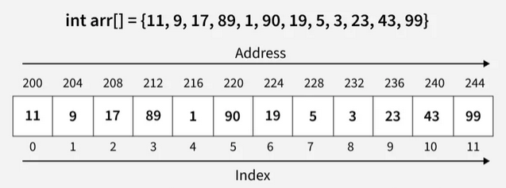

# Arrays

Los *arrays* son estructuras de datos lineales que almacenan sus elementos de manera continua en un espacio de memoria.

Esta colección **solo** permite almacenar el mismo tipo de variable en todos los espacios de memoria reservados.

## Terminología básica dentro de los arrays

- **Array Index**: Este identifica la posición en la que está ubicado cada elemento.
- **Array Element**: Son las variables almacenadas dentro de un array.
- **Array Length**: El tamaño de un array indica la cantidad de elementos que están almacenados dentro de este.

## Representación dentro de la memoria

Todos los elementos de un array están almacenados dentro de locaciones continuas en la memoria. Al momento de inicializar un array, se reserva el espacio en memoria.

*Imagen referencia tomada de [Geek for Geeks](https://www.geeksforgeeks.org/dsa/introduction-to-arrays-data-structure-and-algorithm-tutorials/)*

## Tipos de arrays

Esta estructura de datos se clasifica en dos categorias: *En base a su tamaño* o *En base a sus dimensiones*

- **Clasificación en base a su tamaño**: En esta clasificación, los arrays se pueden dividir entre *tamaño fijo* o *tamaño dinámico*

- **Clasificación en base a sus dimensiones**: Los arrays pueden dividirse en : *Una dimensión (1D)*, *Dos dimensiones / Matriz (2D)* ,*Multi-dimensional (nD)*

Si desea conocer más sobre este tema, por favor dirijase a la fuente [Geek for Geeks](https://www.geeksforgeeks.org/dsa/array-data-structure-guide/)